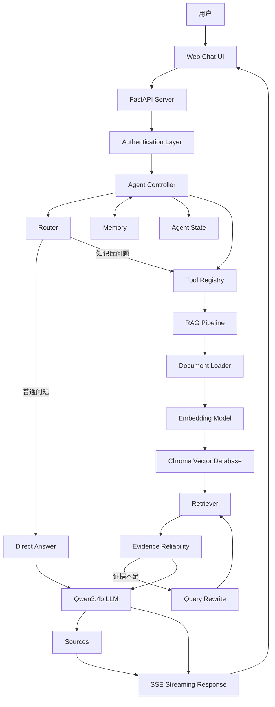

# Agentic RAG System

> 一个面向真实知识库问答的 Agentic RAG 工程项目：让 LLM 负责路由与判断，让检索证据约束最终回答。

## Project Introduction

这是一个基于 LLM 的 Agentic RAG 智能问答系统。它将 LLM Router、知识库检索、证据可靠性判断、Query Rewrite、短期 Memory、用户认证和 SSE Streaming 组合成一个可运行的 AI 应用，适合作为 Agent 工程、RAG 工程和后端系统设计的学习与面试展示项目。

核心能力包括：

- Agent Router：判断问题是否需要知识库。
- RAG 知识库：使用 Chroma 检索项目文档。
- Query Rewrite：证据不足时改写检索 Query。
- Retrieval Reliability：根据检索结果和模型判断选择回答策略。
- Memory：支持有界的多轮对话上下文。
- 用户认证：QQ 邮箱验证码注册/登录和 Session Cookie。
- Streaming：通过 FastAPI + SSE 实时输出回答。
- Evaluation：覆盖 Router、RAG、Rewrite、Memory 和 Stability。

---

## Resume & Interview

面向简历、招聘网站和技术面试的项目材料：

- [简历版本说明](docs/resume_description.md)：简历版、招聘网站版和一分钟自我介绍。
- [技术亮点总结](docs/technical_highlights.md)：Agent、RAG、可靠性、Memory 和工程优化。
- [简历关键词](docs/resume_keywords.md)：便于按岗位整理大模型、后端、RAG 和工程关键词。

---

## Architecture

项目完整架构见 [docs/architecture.md](docs/architecture.md)。GitHub 会直接渲染下面的 Mermaid 图：



## Demo

截图目录用于保存实际运行后的演示素材，当前仓库只预留图片位置，不伪造运行截图。


---

## 面试演示 Demo

提供一个不复制业务逻辑的命令行演示入口：

```powershell
python demo.py
```

菜单包含普通 Agent 问答、RAG 知识库问答、Query Rewrite、Memory 多轮对话、Agent State 追踪和性能分析。完整讲解顺序与面试要点见 [docs/demo_guide.md](docs/demo_guide.md)。

---

## Features

1. 智能路由：使用 Qwen3:4b 判断是否需要检索。
2. RAG 知识库问答：从 `rag_data/` 检索项目知识。
3. Query Rewrite：检索证据不足时最多进行一次改写和二次检索。
4. Retrieval Reliability：记录距离、结果数量和可靠性判断。
5. 多轮 Memory：保留有限历史，支持上下文指代。
6. 多用户隔离：不同 Session 使用独立 Agent 和 Memory。
7. SSE 流式输出：token、status、sources、done、error 事件保持稳定契约。
8. 邮箱验证码登录：QQ 邮箱验证码自动注册或登录。
9. 来源可追溯：最终回答末尾追加真实检索到的 source/page。
10. Agent Trace：展示 request id、工具调用、检索和回答策略等状态。

---

## Tech Stack

- Python 3.14+
- FastAPI / Uvicorn
- Ollama / Qwen3:4b
- LangChain 生态组件
- Chroma
- Sentence Transformers
- SQLite
- 原生 HTML / CSS / JavaScript

---

## Performance

详见 [docs/performance_report.md](docs/performance_report.md)。当前包含：

- 高置信检索 Fast Path，减少重复的 LLM 证据判断。
- Prompt 优化和有界历史注入。
- Chroma / Embedding 预热。
- SSE status 事件，让用户及时看到分析、检索和生成阶段。
- 阶段耗时日志，便于继续进行 P50/P95 分析。

---

## Evaluation

详见 [docs/evaluation_report.md](docs/evaluation_report.md)。评估体系覆盖：

- Router 普通问题和知识库问题分类。
- 高相关、模糊、无关问题的 RAG 检索。
- Query Rewrite 和最多两次 Tool 调用。
- Memory 多轮上下文和多用户隔离。
- Ollama、SSE、认证和 RAG 资源异常处理。

---

## Quick Start

### 1. 准备环境

项目使用 `uv` 管理 Python 环境：

```powershell
uv venv --python 3.14
uv sync
Copy-Item .env.example .env
```

首次运行前编辑 `.env`。本地调试可以使用 `EMAIL_DEBUG_MODE=true`，生产环境不要输出验证码；不要把 `.env` 提交到 Git。

### 2. 准备 Ollama

安装并启动 Ollama，然后下载模型：

```powershell
ollama pull qwen3:4b
```

### 3. 启动服务

推荐使用项目入口：

```powershell
uv run python run.py
```

等价命令：

```powershell
uv run uvicorn src.api.server:app --host 127.0.0.1 --port 8000
```

打开 <http://127.0.0.1:8000/>，按页面提示使用 QQ 邮箱验证码登录。API 文档位于 <http://127.0.0.1:8000/docs>。

### 4. 运行测试

```powershell
uv run python -m unittest discover -s tests -p "test_*.py" -v
uv pip check --python .venv\Scripts\python.exe
```

真实 Ollama / Chroma 评估需要服务运行，并显式开启：

```powershell
$env:RUN_REAL_EVALUATION="1"
uv run python -m unittest tests.evaluation.test_agent_evaluation -v
```

---

## 配置说明

从 `.env.example` 复制配置模板后，至少根据运行环境确认：

- `SMTP_*`：QQ 邮箱 SMTP 主机、端口、邮箱和授权码。
- `EMAIL_DEBUG_MODE`：仅用于本地调试验证码。
- `AUTH_DB_PATH`：SQLite 数据库路径，默认位于 `data/auth.db`。
- `SESSION_*`：Session Cookie 名称、安全属性和有效期。
- `OLLAMA_*`：本地 Ollama 地址和生成配置。

SMTP 密码必须使用 QQ 邮箱生成的授权码，而不是邮箱登录密码。真实凭据只能放在本地 `.env` 或部署平台的 Secret 中。

## GPU / CUDA

项目依赖声明提供通用 Torch 版本范围，不硬编码本机 CUDA 路径。需要 NVIDIA GPU 时，请根据操作系统、Python 版本、驱动和 CUDA 版本，使用 [PyTorch 官方安装选择器](https://pytorch.org/get-started/locally/) 安装匹配的 wheel，再执行其余依赖安装。

```python
import torch
print(torch.cuda.is_available())
```

显卡驱动、CUDA Toolkit 和 Ollama 的 GPU 支持属于运行环境配置，不由本项目自动安装或管理。

---

## Project Structure

```text
agent/
├── src/
│   ├── agent/       # Router、Loop、Memory、State
│   ├── api/         # FastAPI、SSE 和页面
│   ├── auth/        # QQ 邮箱验证码和 Session
│   └── tools/       # Tool Registry 与 RAG Tool
├── rag_data/        # 示例知识库文档
├── tests/           # 单元、接口和 Evaluation 测试
├── docs/            # 性能、评估、发布和项目概述
├── screenshots/     # GitHub 演示截图
├── run.py           # 本地启动入口
├── pyproject.toml
└── .env.example
```

## Future Work

- 多 Agent 协作与复杂任务分解。
- 更强模型和可配置的模型路由。
- 云端部署、弹性扩容与集中式 Observability。
- 更大规模、多格式知识库。
- 更完整的离线评测集和线上质量反馈闭环。

---

## Interview

面向项目讲解和秋招面试的资料：

- [项目面试指南](docs/interview_guide.md)：项目一句话介绍、核心亮点和工程化设计。
- [面试问题库](docs/interview_questions.md)：Agent、RAG、性能和工程问题参考回答。
- [五分钟 Demo 流程](docs/interview_demo_script.md)：现场演示顺序和讲解重点。

推荐入口：先阅读项目面试指南，再运行 `python demo.py`，最后使用问题库准备追问。
