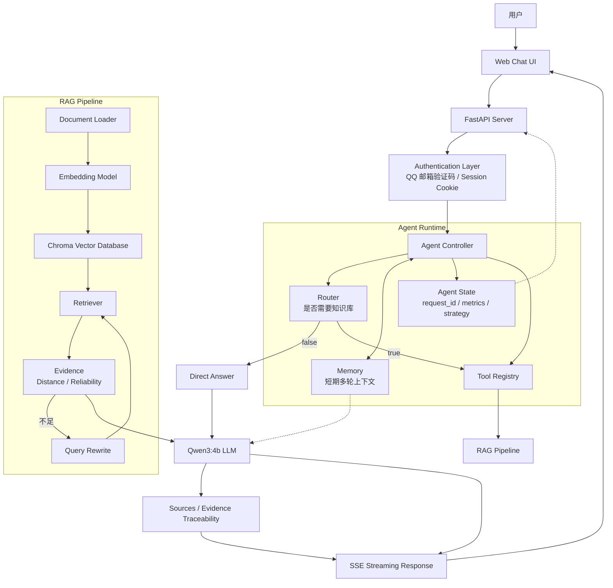

# Agentic RAG System 架构图

下面的 Mermaid 图展示从浏览器请求到最终 SSE 响应的主要链路，以及 Agent 内部的 Router、Memory、State 和 Tool Registry 关系。

## 关键边界

- Authentication Layer 负责用户身份和 Session，不参与 RAG 检索决策。
- Agent Controller 通过 Router 选择直接回答或调用唯一的 RAG Tool。
- Tool Registry 隔离 Agent 与 Tool 的具体实现，RAG 检索最多执行两次。
- Evidence Reliability 和 Query Rewrite 只在知识库路径中生效。
- 最终回答通过 Qwen3:4b 生成，真实检索到的 source/page 由程序整理后追加。
- Agent State 和 Observability 记录请求阶段信息，但不把完整 Prompt、thinking 或大段 Evidence 暴露给用户。
